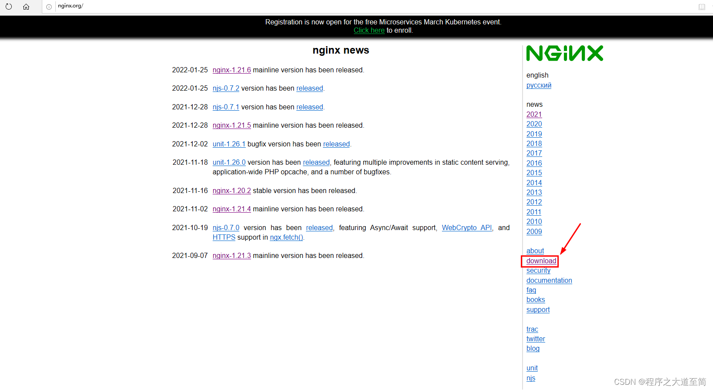
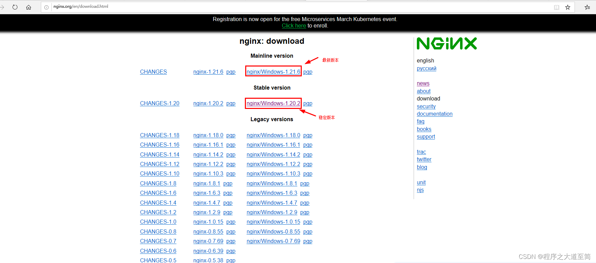
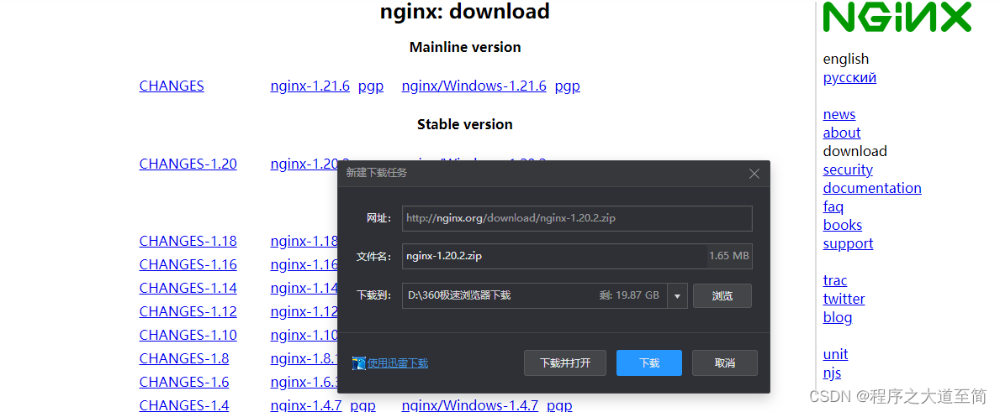

# nginx安装

## Linux下nginx安装、配置与使用

### 简介

* 系统平台：CentOS release 6.6 \(Final\) 64位。

* 软件安装目录 `/usr/local/src`

* 常用nginx安装目录（推荐） `/usr/local/nginx`

* 下面示例中nginx安装目录 `/usr/local/webserver/nginx/sbin/nginx`

### 参考文档

[菜鸟教程: http://www.runoob.com/linux/nginx-install-setup.html](http://www.runoob.com/linux/nginx-install-setup.html)

[https://www.yiibai.com/nginx/nginx-install-linux-packages.html](https://www.yiibai.com/nginx/nginx-install-linux-packages.html)

### 一、安装编译工具及库文件

```text
yum -y install make zlib zlib-devel gcc-c++ libtool  openssl openssl-devel
```

### 二、首先要安装 PCRE

PCRE 作用是让 Nginx 支持 Rewrite 功能。

1、下载 PCRE 安装包，下载地址： [http://downloads.sourceforge.net/project/pcre/pcre/8.35/pcre-8.35.tar.gz](http://downloads.sourceforge.net/project/pcre/pcre/8.35/pcre-8.35.tar.gz)

```text
[root@bogon src]# wget http://downloads.sourceforge.net/project/pcre/pcre/8.35/pcre-8.35.tar.gz
```


2、解压安装包:

```text
[root@bogon src]# tar zxvf pcre-8.35.tar.gz
```

3、进入安装包目录

```text
[root@bogon src]# cd pcre-8.35
```

4、编译安装

```text
[root@bogon pcre-8.35]# ./configure
[root@bogon pcre-8.35]# make && make install
```

5、查看pcre版本

```text
[root@bogon pcre-8.35]# pcre-config --version
```


### 安装 Nginx

1、下载 Nginx，下载地址：[http://nginx.org/download/nginx-1.17.5.tar.gz](http://nginx.org/download/nginx-1.6.2.tar.gz)

```text
[root@bogon src]# wget http://nginx.org/download/nginx-1.17.5.tar.gz
```

2、解压安装包

```text
[root@bogon src]# tar zxvf nginx-1.17.5.tar.gz
```

3、进入安装包目录

```text
[root@bogon src]# cd nginx-1.17.5
```

4、编译安装

```text
[root@bogon nginx-1.6.2]# ./configure --prefix=/usr/local/webserver/nginx --with-http_stub_status_module --with-http_ssl_module --with-pcre=/usr/local/src/pcre-8.35
[root@bogon nginx-1.6.2]# make
[root@bogon nginx-1.6.2]# make install
```

5、查看nginx版本

```text
[root@bogon nginx-1.6.2]# /usr/local/webserver/nginx/sbin/nginx -v
```


到此，nginx安装完成。

## Nginx 配置

创建 Nginx 运行使用的用户 www：

```text
[root@bogon conf]# /usr/sbin/groupadd www 
[root@bogon conf]# /usr/sbin/useradd -g www www

```

> /usr/sbin/useradd -g www www 执行可能会报错 
>
> 报如下错误：
>
> groupadd: invalid group ID 'www'
>
> 修复方式如下：

```text
[root@bogon local]# id www
[root@bogon local]# id: www: no such user
[root@bogon local]# groupadd www
[root@bogon local]# groupadd: group 'www' already exists
//开始添加www用户
[root@bogon local]# useradd -g www -s /sbin/nologin www
//再查看一下
[root@bogon local]# id www
uid=1001(www) gid=1000(www) 组=1000(www)
```

配置nginx.conf ，将/usr/local/webserver/nginx/conf/nginx.conf替换为以下内容

```text
[root@bogon conf]#  cat /usr/local/webserver/nginx/conf/nginx.conf

user www www;
worker_processes 2; #设置值和CPU核心数一致
error_log /usr/local/webserver/nginx/logs/nginx_error.log crit; #日志位置和日志级别
pid /usr/local/webserver/nginx/nginx.pid;
#Specifies the value for maximum file descriptors that can be opened by this process.
worker_rlimit_nofile 65535;
events
{
  use epoll;
  worker_connections 65535;
}
http
{
  include mime.types;
  default_type application/octet-stream;
  log_format main  '$remote_addr - $remote_user [$time_local] "$request" '
               '$status $body_bytes_sent "$http_referer" '
               '"$http_user_agent" $http_x_forwarded_for';

#charset gb2312;

  server_names_hash_bucket_size 128;
  client_header_buffer_size 32k;
  large_client_header_buffers 4 32k;
  client_max_body_size 8m;

  sendfile on;
  tcp_nopush on;
  keepalive_timeout 60;
  tcp_nodelay on;
  fastcgi_connect_timeout 300;
  fastcgi_send_timeout 300;
  fastcgi_read_timeout 300;
  fastcgi_buffer_size 64k;
  fastcgi_buffers 4 64k;
  fastcgi_busy_buffers_size 128k;
  fastcgi_temp_file_write_size 128k;
  gzip on; 
  gzip_min_length 1k;
  gzip_buffers 4 16k;
  gzip_http_version 1.0;
  gzip_comp_level 2;
  gzip_types text/plain application/x-javascript text/css application/xml;
  gzip_vary on;

  #limit_zone crawler $binary_remote_addr 10m;
 #下面是server虚拟主机的配置
 server
  {
    listen 80;#监听端口
    server_name localhost;#域名
    index index.html index.htm index.php;
    root /usr/local/webserver/nginx/html;#站点目录
      location ~ .*\.(php|php5)?$
    {
      #fastcgi_pass unix:/tmp/php-cgi.sock;
      fastcgi_pass 127.0.0.1:9000;
      fastcgi_index index.php;
      include fastcgi.conf;
    }
    location ~ .*\.(gif|jpg|jpeg|png|bmp|swf|ico)$
    {
      expires 30d;
  # access_log off;
    }
    location ~ .*\.(js|css)?$
    {
      expires 15d;
   # access_log off;
    }
    access_log off;
  }

}
```

检查配置文件nginx.conf的正确性命令：

```text
[root@bogon conf]# /usr/local/webserver/nginx/sbin/nginx -t
[root@bogon conf]# nginx -c /usr/local/nginx/conf/nginx.conf
# -c filename     : 设置配置文件（默认是：/usr/local/etc/nginx/nginx.conf）
```


## 启动 Nginx

Nginx 启动命令如下：

```shell script
[root@bogon conf]# /usr/local/webserver/nginx/sbin/nginx
```


## 访问站点

从浏览器访问我们配置的站点ip：


## Nginx 其他命令

以下包含了 Nginx 常用的几个命令：

```shell script
/usr/local/webserver/nginx/sbin/nginx -s reload            # 重新载入配置文件
/usr/local/webserver/nginx/sbin/nginx -s reopen            # 重启 Nginx
/usr/local/webserver/nginx/sbin/nginx -s stop              # 停止 Nginx
/usr/local/webserver/nginx/sbin/nginx -c /usr/local/nginx/conf/nginx.conf # 指定配置文件启动命令
/usr/local/webserver/nginx/sbin/nginx -t                            # 检测配置文件是否编译正确
```

## windows下nginx安装、配置与使用

### 简介

Nginx 是一个很强大的高性能Web和反向代理服务，也是一种轻量级的Web服务器，可以作为独立的服务器部署网站，应用非常广泛，特别是现在前后端分离的情况下。而在开发过程中，我们常常需要在window系统下使用Nginx作为Web服务器。

### 下载Nginx

#### 1、去到Nginx官网：http://nginx.org/  ，然后点击“download”



#### 2、在下载界面选择自己想要下载的版本，点击对应版本，下载Nginx。





#### 3、 Nginx的压缩包下载完成。


### Nginx的使用

#### 1、解压Nginx压缩包。


#### 2、在nginx的配置文件是conf目录下的nginx.conf，默认配置的nginx监听的端口为80，如果本地电脑的80端口有被占用，如果本地80端口已经被使用则修改成其他端口。


查看80端口是否被占用的命令是：

```shell script
netstat -ano | findstr 0.0.0.0:80
``` 
或 

```shell script
netstat -ano | findstr "80"
``` 

#### 3、启动Nginx方法：

* 直接双击Nginx目录下的nginx.exe，双击后一个黑色的弹窗一闪而过就消失了，启动就完成了。


* 打开电脑的cmd命令窗口，然后切换到nginx目录下，输入命令 nginx.exe 或者 start nginx ，回车即可完成启动。


#### 4、查看Nginx是否成功的方法


#### 5、关闭Nginx

* 在cmd命令窗口里面输入nginx命令(快速停止nginx)

```
#在cmd窗口模式下，进入到nginx安装目录，执行如下命令
nginx -s stop
```  

* 使用(完整有序的停止nginx)命令

```shell script
#在cmd窗口模式下，进入到nginx安装目录，执行如下命令
nginx -s quit
```

* 使用taskkill命令

```shell script
#在cmd窗口模式下，进入到nginx安装目录，执行如下命令
taskkill /f /t /im nginx.exe
```

#### 6、重启Nginx

```shell script
#在cmd窗口模式下，进入到nginx安装目录，执行如下命令
nginx -s reload
```

#### 7、重新打开日志文件：

```shell script
#在cmd窗口模式下，进入到nginx安装目录，执行如下命令
nginx -s reopen
```

#### 8、查看Nginx版本：

```shell script
nginx -v
```
